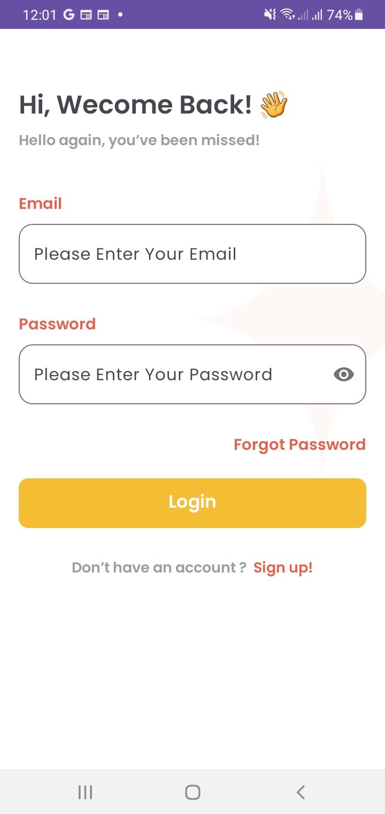
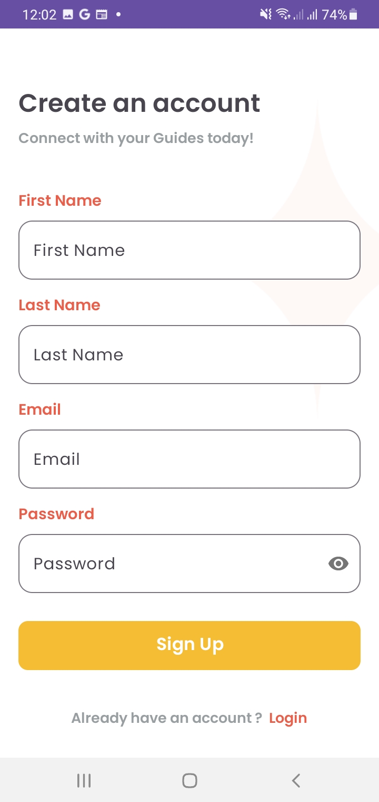
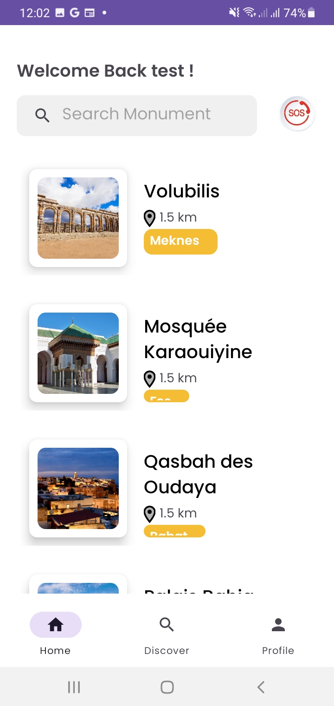
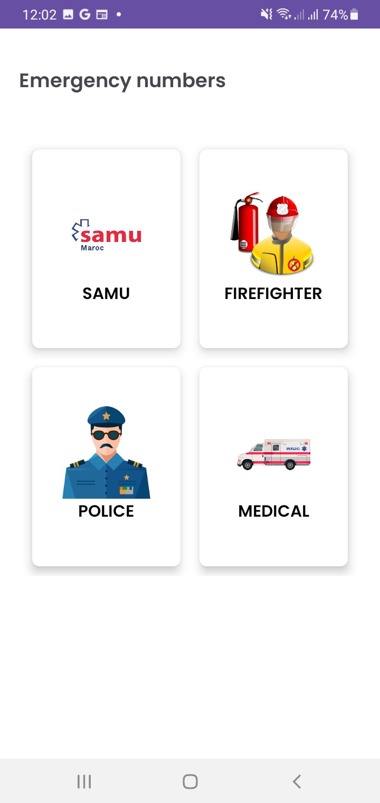
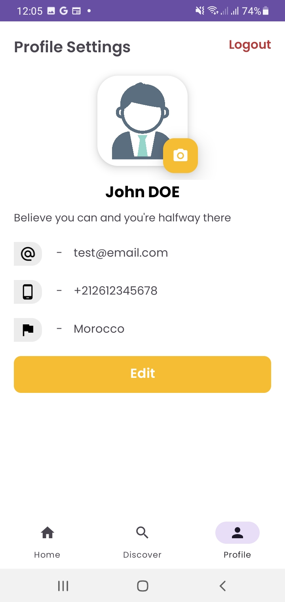
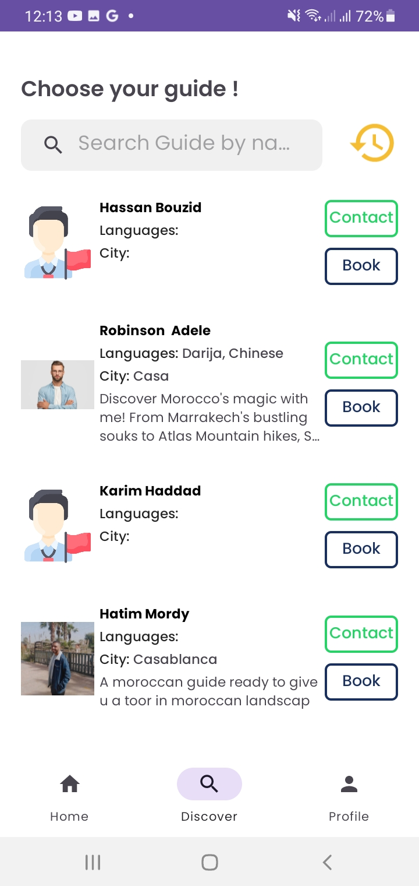

# Tourist Guide Booking

### Overview
**Trustworthy Morocco** is a mobile application designed to bridge the gap between tourists visiting Morocco and certified local guides. The app provides tourists with an easy way to find, book, and communicate with local guides based on preferences like location, language, expertise, and more. It also includes offline functionalities for exploring monuments and features Augmented Reality (AR) for an enhanced user experience.

### Key Features
- **Guide Search & Filters:** Filter guides by location, language, expertise, and user ratings.
- **Booking Management:** Tourists can send and manage booking requests with in-app notifications and secure communication.
- **Monument Discovery:** Access a comprehensive database of Moroccan monuments, available offline.
- **Personalized Recommendations:** Receive custom itineraries based on preferences.
- **Augmented Reality (AR):** Use AR to explore monuments with historical overlays.
- **In-App Chat:** Communicate with guides for tour details and adjustments.
- **Community Forum:** Share experiences and connect with other users.

## Screenshots
Here are some images to illustrate the project:
<table>
      <tr>
        <td>
          <p>Login Screen</p>
          
        </td>
        <td>
          <p>Register Screen</p>
          
        </td>
        <td>
          <p>Home/Monuments Screen</p>
          
        </td>
      </tr>
      <tr>
        <td>
          <p>SOS Screen</p>
          
        </td>
        <td>
          <p>Profile Screen</p>
          
        </td>
        <td>
          <p>Guides Screen</p>
          
        </td>
      </tr>
    </table>


### Development Stack
- **Language:** Java (Android) with XML for UI components
- **IDE:** Android Studio (Legacy technology stack)
- **Version Control:** GitHub for version tracking and collaboration
- **Backend:** Firebase for real-time data and user authentication
- **Offline Functionality:** SQLite for storing monument information and itineraries locally.

### Installation
1. Clone the repository:
    ```bash
      git clone https://github.com/your-repo/trustworthy-morocco.git
    ```
2. Open the project in Android Studio.
3. Sync Gradle and build the project.
4. Set up Firebase for authentication and database connectivity.
5. Run the app on an Android emulator or device.  

### License
This project is licensed under the MIT License – see the LICENSE file for details

## Contributors

This project was developed by the following team:

- **[Is2m](https://github.com/Is-2m)** 
- **[Hatim](https://github.com/hatimordy)**
- **[Rhada](https://github.com/rhada1)**
